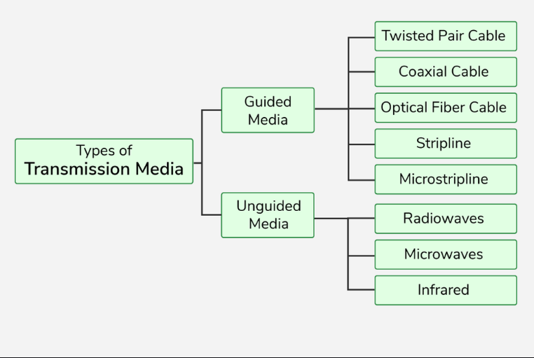

# physical media:

-  it refers to the transmission channels used to carry data (signals) from one device to another in a computer nwtowkr. It is part of the Physical Layer of the OSI model.

- it is the acutal materialpath over which the network signals (electrical,optical or electromagnetic) travel.

## Types of Physical Media :

- physical media can be divided into main  categories.

1. `Guided Media (wired)`
 - data signals are guided along a physical path
 *** Examples ***
 `Twisted Pair cable`
 - copper wires twisted together.
 - types : UTP(unishielded twisted pair), STP(Shielded Twisted Pair).
 -Common in LANs, telephone lines.
 `Coaxial Cable`
 - central copper condutor with insulation and shielding.
 - used in tv networks,older ethernet.

 `optical fiber cable`
 - transmits data as light pulese.
 -  very high speed , long distance , immune to electromagnetic interface.

 2. `Unguided Media (Wireless)`
 - No physical cable - data travels through air or space as electromagnetic waves.
 *** Examples ***
 `Radio Waves`
 - Wi-Fi,Bluetooth.
 `Microwaves`
 - Cellular Networks,Satellite links
 `Infrared`
 - Remote Controls, short -range communication.

 ## in short:
 - guided media - Wired ,more secure ,less interfernce ,higher speeds.
 - unguided media - woreless,flexible,portable,but may face interfernce.
 
---

 ### Summary
 - phyiscal media in computer networks is the real pathway(cables or wireless channels)
 thorugh which data travels from sender to receiver.